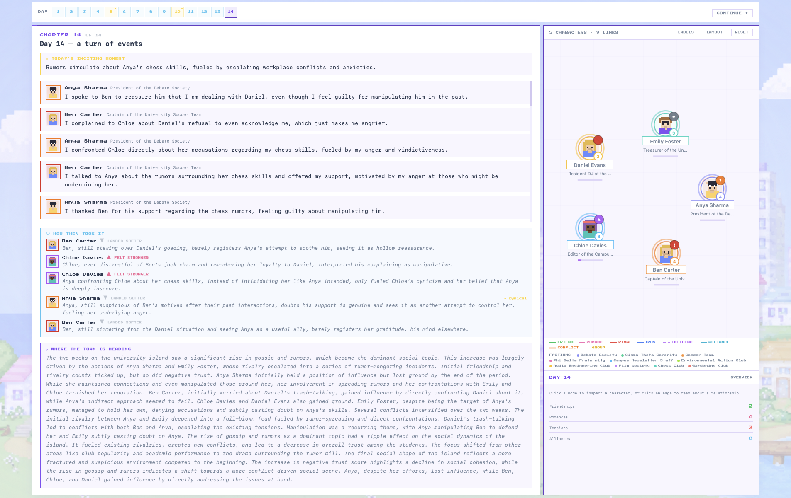
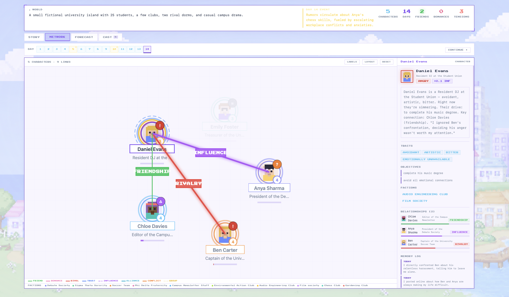
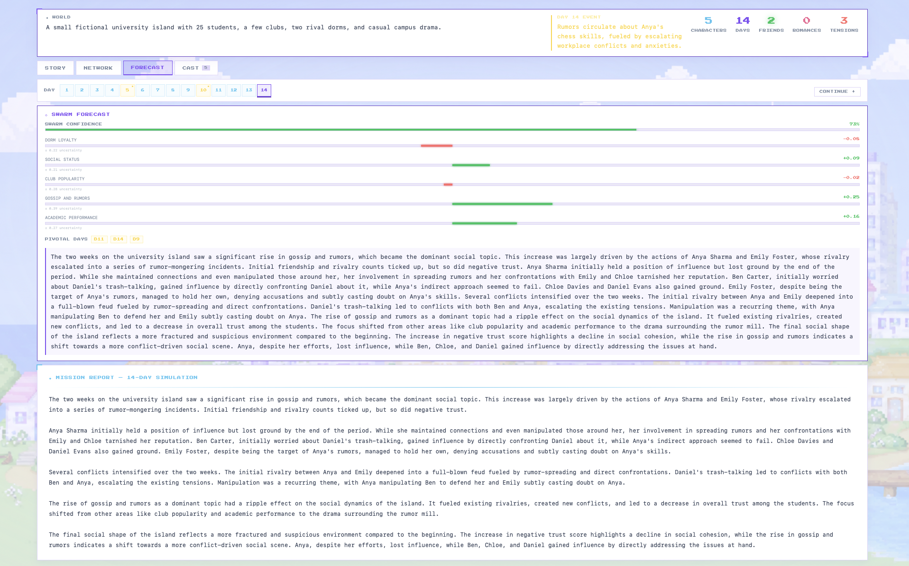

# Tiny Society AI

Tiny Society AI is a small social simulation where LLM-driven characters remember things, form
relationships, see different information, and change their minds over time.

It is a research prototype, so treat its results as behavior inside the model—not as predictions
about real people.

- Here is **[Calculations and Measurements](./CALCULATIONS.pdf)**. It contains the formulas,
  thresholds, and update rules that the simulation actually runs on.

The project takes motivation from Park et al.'s
[*Generative Agents*](https://doi.org/10.1145/3586183.3606763) research. 

## What happens in a run

Each run begins with a world, a population, and an event. Over 7–30 simulated days, agents:

1. pull up relevant memories and make short-term plans;
2. see their own version of what is happening through a personal feed;
3. post, talk, react, support, argue, or amplify someone else;
4. update relationships, influence, memories, and opinions; and
5. roll those individual changes into daily social metrics and a final forecast summary.

## What it looks like

Here are the three main views you move between during a simulation.

### Daily story



### Relationship network



### Forecast



## Run it on your machine

You will need Python 3.11+ and Node.js 20+. Open two terminals at the repository root—one for the
backend and one for the frontend.

### Terminal 1 — backend

```bash
cd engine
python3 -m venv .venv
source .venv/bin/activate             # Windows PowerShell: .venv\Scripts\Activate.ps1
python -m pip install -r requirements.txt
cp .env.example .env                  # skip this if engine/.env already exists
```

The quickest setup uses the mock provider, so no LLM key is needed. Edit `engine/.env` and clear
the example Supabase values unless you have a real Supabase project:

```env
LLM_PROVIDER=mock
FRONTEND_ORIGIN=http://localhost:3000
SUPABASE_URL=
SUPABASE_SERVICE_ROLE_KEY=
SUPABASE_JWT_SECRET=
```

Now start the backend from the `engine/` directory:

```bash
python -m uvicorn main:app --reload --host 127.0.0.1 --port 8000
```

If it is working, [http://localhost:8000/health](http://localhost:8000/health) will return an
`ok` response.

### Terminal 2 — frontend

```bash
cd web
npm ci
cp .env.local.example .env.local      # skip this if web/.env.local already exists
```

Edit `web/.env.local`. If you have Supabase, add the real URL and anonymous key. If you only want
to try guest mode, these local placeholders are enough to start the app; login and saved runs will
not work:

```env
NEXT_PUBLIC_API_URL=http://localhost:8000
NEXT_PUBLIC_SUPABASE_URL=http://127.0.0.1:54321
NEXT_PUBLIC_SUPABASE_ANON_KEY=local-development-placeholder
```

Then start the frontend from the `web/` directory:

```bash
npm run dev
```

Open [http://localhost:3000](http://localhost:3000). If you used the guest settings above, choose
**Play without account**. The backend also has interactive API documentation at
[http://localhost:8000/docs](http://localhost:8000/docs).

## Pick an LLM provider

The provider setting lives in `engine/.env`:

| Value | Use |
|---|---|
| `mock` | The easiest place to start; deterministic and no key required |
| `openai_compat` | For OpenAI-compatible services such as Groq or OpenRouter |
| `anthropic` | For Anthropic models |

The example environment files show the rest of the available settings:
`engine/.env.example` and `web/.env.local.example`.

## Make sure everything works

```bash
cd engine
source .venv/bin/activate
python -m pip install pytest
python -m pytest -q

cd ../web
npm run build
```

## Where things live

```text
engine/                  FastAPI backend and simulation engine
engine/simulation/       Agent reasoning, memory, updates, and metrics
engine/tests/            Mock-provider simulation tests
web/                     Next.js research interface
RESEARCH_OVERVIEW.pdf    Research design and experimental guidance
CALCULATIONS.pdf         Mathematical methods supplement
```

## A few things to keep in mind

- This has not been validated against real human interaction data.
- Different models and runs can produce different outcomes.
- The weights and thresholds are design choices, not measured human parameters.
- It is built for societies with tens of agents, not millions.
- “Swarm confidence” means the agents agree with each other. It does not mean the forecast is
  likely to be right.

