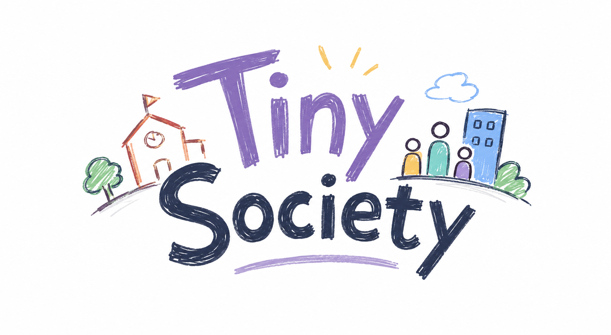
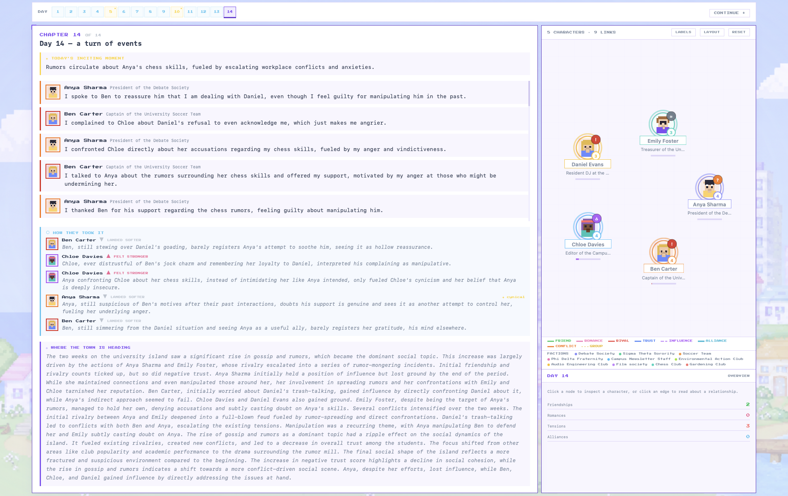
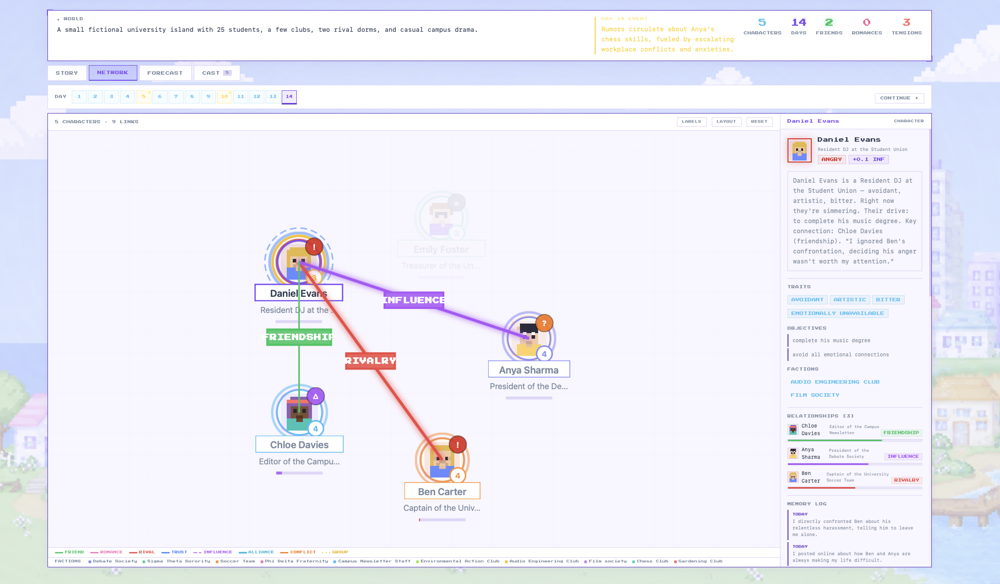
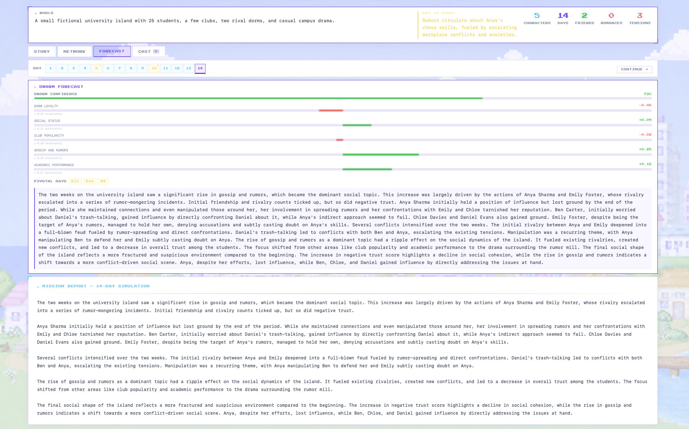

# Tiny Society AI

**A small social simulation where LLM-driven characters remember things, form relationships, see
different versions of events, and change their minds over time.**



You describe a world, cast up to 7 characters, drop an event into their lives, and watch a week
unfold day by day. Along the way you can talk to characters, whisper advice to them, throw in new
events, and bet on how it all ends.

> **This is a research prototype.** Treat what it produces as behavior *inside the model*, not as
> predictions about real people.

The project takes inspiration from Park et al.'s
[*Generative Agents*](https://doi.org/10.1145/3586183.3606763).

---

**Contents:** [How a run works](#how-a-run-works) ·
[What you can do](#what-you-can-do) ·
[Screenshots](#screenshots) ·
[Quick start](#quick-start) ·
[Run with Docker](#run-with-docker) ·
[Configuration](#configuration) ·
[Accounts and saved runs](#accounts-and-saved-runs) ·
[Tests](#tests) ·
[Project layout](#project-layout)

---

## How a run works

Each run starts with a **world** (a free-text premise), a **cast** of 5–7 agents, and an
**event**. First, a single AI pass reads the premise into a **world lens**: what the
characters are called, what can and can't exist there, where people gather, how the story
should sound, and what everyone is really fighting over. Every later stage reads that lens, so a
monastery reads like a monastery and an esports team reads like an esports team.

Then, over up to 7 simulated days, each agent:

1. **Recalls** relevant memories, ranked by relevance, recency, and importance, and makes a
   short-term plan (refreshed every few days).
2. **Perceives** its own slice of the world. Actions only reach agents who could plausibly have
   seen them, which is how gossip, factions, and misinformation emerge.
3. **Acts** in character, toward whoever they choose, with an audience: everyone, the people
   who are there, or one person alone. The action is written in the world's own words.
4. **Updates** relationships, influence, memories, and beliefs.

A few guardrails keep this believable:

- **Relationships are earned.** An agent's choice only nudges the underlying affinity between two
  people. Whether that becomes a friendship, rivalry, or romance depends on what builds up between
  them over time, and on both sides, not on one LLM call deciding it.
- **Characters stay in character.** A persona check blocks actions a character wouldn't take given
  their mood, traits, and history with the target, and swaps in the closest action they would.
- **Agents reflect.** Every few days they turn recent memories into higher-level insights.

At the end of each day, individual changes are rolled up into social metrics (friendships,
rivalries, factions, fragmentation, and so on). When the run finishes, they become a written report
and a population forecast.

## What you can do

| | |
|---|---|
| **Build a world** | Write a premise, create characters by hand, or let the AI fill out the cast |
| **Cast people you know** | Add your own characters, and the app suggests where they'd fit in the world. Nothing changes unless you accept |
| **Set the stakes** | Pick a starting event and, if you like, a prediction question for the forecast to answer |
| **Make a prophecy** | Write down how you think it ends. The AI grades it against what actually happened |
| **Step through time** | Run the whole week at once, or go one day at a time and pause wherever you want |
| **Talk to characters** | Chat with any agent in character, based on what they currently remember |
| **Whisper advice** | Put a suggestion into an agent's memory and see whether they follow it |
| **Shake things up** | Add an event or a new character partway through the run |
| **Save runs** | Sign in to save a world and pick it up later (needs Supabase) |

## Screenshots

**Daily story:** what happened today, told as short scenes and highlight cards.



**Relationship network:** who is close to whom, and how strong each bond is.



**Forecast:** where the population is leaning, how much the agents agree, and the days that changed things.



## Quick start

This setup uses the built-in **mock provider**, so you won't need an LLM API key or a Supabase
project.

**Requirements:** Python **3.11–3.13** and Node.js **20+**.

> [!WARNING]
> **Python 3.14 is not supported yet.** `pydantic==2.9.2` relies on a `pydantic-core` wheel built
> against PyO3 0.22, which tops out at 3.13. On 3.14 the install fails with
> `Failed building wheel for pydantic-core`. See [Using Python 3.13 alongside 3.14](#using-python-313-alongside-314).

### 1. Backend (terminal 1)

```bash
cd engine
python3 --version                     # must report 3.11–3.13
python3 -m venv venv
source venv/bin/activate              # Windows PowerShell: venv\Scripts\Activate.ps1
python -m pip install -r requirements.txt
cp .env.example .env                  # skip if engine/.env already exists
```

Open `engine/.env` and clear the placeholder Supabase values. The backend refuses to start if
Supabase is only half set up:

```env
LLM_PROVIDER=mock
FRONTEND_ORIGIN=http://localhost:3000
SUPABASE_URL=
SUPABASE_SERVICE_ROLE_KEY=
```

Start the server:

```bash
python -m uvicorn main:app --reload --host 127.0.0.1 --port 8000
```

Check it at [localhost:8000/health](http://localhost:8000/health). Interactive API docs are at
[localhost:8000/docs](http://localhost:8000/docs).

### 2. Frontend (terminal 2)

```bash
cd web
npm ci
cp .env.local.example .env.local      # skip if web/.env.local already exists
```

For guest mode, these placeholders are enough to start the app. Sign-in and saved runs won't work
until you add real Supabase values:

```env
NEXT_PUBLIC_API_URL=http://localhost:8000
NEXT_PUBLIC_SUPABASE_URL=http://127.0.0.1:54321
NEXT_PUBLIC_SUPABASE_ANON_KEY=local-development-placeholder
```

```bash
npm run dev
```

Open [localhost:3000](http://localhost:3000) and choose **Play without account**.

### Using Python 3.13 alongside 3.14

If `python3 --version` reports 3.14, create the virtualenv with a 3.13 interpreter instead.
Installing 3.13 leaves 3.14 in place.

```bash
# macOS (Homebrew). `brew --prefix` works on both Apple Silicon and Intel.
brew install python@3.13
"$(brew --prefix python@3.13)/bin/python3.13" -m venv venv

# Debian/Ubuntu (deadsnakes PPA)
sudo add-apt-repository ppa:deadsnakes/ppa && sudo apt update
sudo apt install python3.13 python3.13-venv
python3.13 -m venv venv

# Windows (PowerShell), via the py launcher
py -3.13 -m venv venv
```

Then activate it and run `python -m pip install -r requirements.txt` as above.

## Run with Docker

You can also run both services with Docker Compose. Create `engine/.env` first (see above), then
from the repository root:

```bash
docker compose up --build
```

The backend runs on port 8000 and the frontend on port 3000. Next.js bakes `NEXT_PUBLIC_*`
variables in at build time, so pass them through your shell environment or a root `.env` file
before building, not through `web/.env.local`.

## Configuration

### LLM provider

Set `LLM_PROVIDER` in `engine/.env`:

| Value | Use | Required settings |
|---|---|---|
| `mock` | Deterministic, offline, free. Best for development and tests | none |
| `anthropic` | Claude models | `ANTHROPIC_API_KEY`, `ANTHROPIC_MODEL` |
| `openai_compat` | Any OpenAI-compatible API (Groq, OpenRouter, …) | `OPENAI_COMPAT_BASE_URL`, `OPENAI_COMPAT_API_KEY`, `OPENAI_COMPAT_MODEL` |

The backend checks these settings at startup, so a missing key fails right away instead of on the
first request.

**Model tiers (optional).** You can send bulk background work to a cheaper model and the moments
players see to a stronger one with `*_MODEL_CHEAP` and `*_MODEL_STRONG` (for example
`ANTHROPIC_MODEL_CHEAP`). If a tier isn't set, it uses the main `*_MODEL`.

### Other backend settings

| Variable | Default | Purpose |
|---|---|---|
| `FRONTEND_ORIGIN` | `http://localhost:3000` | Allowed CORS origin |
| `LLM_MAX_CONCURRENCY` | `6` | Max LLM requests running at once |
| `MAX_LIVE_WORLDS` | `200` | Worlds kept in memory before the oldest is dropped |
| `LOG_LEVEL` | `INFO` | Python logging level |
| `SUPABASE_URL`, `SUPABASE_SERVICE_ROLE_KEY` | empty | Turns on accounts and saved runs. Set both or neither |

Full templates are in [`engine/.env.example`](./engine/.env.example) and
[`web/.env.local.example`](./web/.env.local.example).

## Accounts and saved runs

Saved runs are optional and need a [Supabase](https://supabase.com) project:

1. In the Supabase SQL editor, run [`supabase_migration.sql`](./supabase_migration.sql). It creates
   the `saves` table with row-level security.
2. Set `SUPABASE_URL` and `SUPABASE_SERVICE_ROLE_KEY` in `engine/.env`.
3. Set `NEXT_PUBLIC_SUPABASE_URL` and `NEXT_PUBLIC_SUPABASE_ANON_KEY` in `web/.env.local`.

**Free-tier tip:** Supabase pauses free projects after 7 days without activity. To prevent that,
run [`supabase_keepalive.sql`](./supabase_keepalive.sql) and add `SUPABASE_URL` and
`SUPABASE_ANON_KEY` as GitHub Actions secrets. The
[keep-alive workflow](./.github/workflows/supabase-keepalive.yml) will then ping the project every
3 days.

## Tests

The tests use the mock provider, so they don't need network access or API keys.

```bash
cd engine
source venv/bin/activate
python -m pip install pytest
python -m pytest -q
```

- `tests/test_interaction.py`: unit tests for the action contract, text handling, and prompt
  hygiene.
- `tests/test_realism.py`: calibration checks that whole-society behavior stays believable across
  several seeds.

To check that the frontend compiles:

```bash
cd web
npm run build
```

## Project layout

```text
engine/                    FastAPI backend
├── main.py                API routes (world setup, simulation, interventions, saves)
├── llm.py                 Provider adapters: mock, Anthropic, OpenAI-compatible
├── simulation/
│   ├── engine.py          The daily loop
│   ├── worldgraph.py      World facts + the world lens, read once at setup
│   ├── premise.py         Renders the lens into every per-day prompt
│   ├── fitting.py         Suggests where an authored character fits
│   ├── memory.py          Memory retrieval (relevance × recency × importance)
│   ├── planner.py         Short-term plans
│   ├── audience.py        Who an action was in front of
│   ├── observation.py     Who sees which actions
│   ├── reasoner.py        Each agent's action choice
│   ├── persona.py         Blocks out-of-character actions
│   ├── consequence.py     Turns actions into relationship changes
│   ├── reflector.py       Periodic reflection
│   ├── stance.py          Beliefs and opinion shifts
│   ├── metrics.py         Daily society-level metrics
│   └── reporter.py        Final report and forecast
└── tests/                 Mock-provider test suites
web/                       Next.js 14 + Tailwind frontend
├── app/                   Pages and global styles
└── components/            Setup, story, network graph, inspector, saves
supabase_migration.sql     Saved-runs schema
docker-compose.yml         Runs both services locally
```
